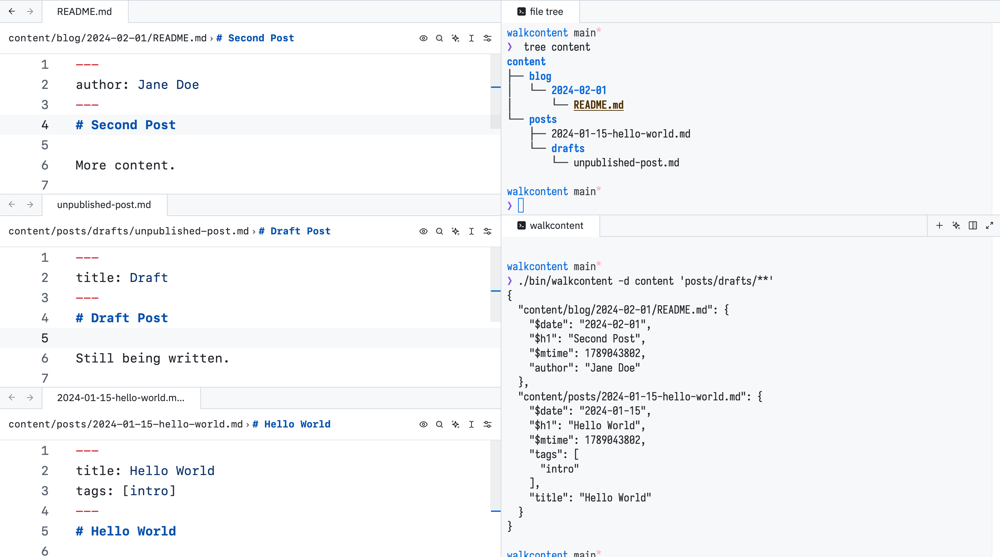

# walkcontent

A CLI to recursively walk markdown content directories (for example, your static site blog), parse each file's metadata, and write a JSON map of file path to that metadata. Intended for use with tools such as sitemap generators, URL mappers, etc.

The following data is extracted from each file:

- Top-level heading, `$h1`
- Date from file path, `$date`
- File modification time, `$mtime`
- Line number where content starts (after the frontmatter block, if any), `$contentStart`
- YAML frontmatter block, flattened into key-value pairs added directly to the output

## Example



For a given input directory structure like this:

```
content
├── blog
│   └── 2024-02-01
│       └── index.md
└── posts
    ├── 2024-01-15-hello-world.md
    └── drafts
        └── unpublished-post.md
```

<details>
<summary>Contents of the above structure</summary>

```sh
mkdir -p content/posts/drafts content/blog/2024-02-01

cat <<'EOF' > content/posts/2024-01-15-hello-world.md
---
title: Hello World
tags: [intro]
---
# Hello World

Welcome to my blog.
EOF

cat <<'EOF' > content/posts/drafts/unpublished-post.md
---
title: Draft
---
# Draft Post

Still being written.
EOF

cat <<'EOF' > content/blog/2024-02-01/index.md
---
author: Jane Doe
---
# Second Post

More content.
EOF
```

</details>

Run `walkcontent` with the `-d` flag to walk the `content` directory. Passing `posts/drafts/**` as a second argument excludes the files in `posts/drafts/` from scanning/output.

```sh
walkcontent -d content 'posts/drafts/**'
```

```json
{
  "content/blog/2024-02-01/index.md": {
    "$contentStart": 4,
    "$date": "2024-02-01",
    "$h1": "Second Post",
    "$mtime": 1706745600,
    "author": "Jane Doe"
  },
  "content/posts/2024-01-15-hello-world.md": {
    "$contentStart": 4,
    "$date": "2024-01-15",
    "$h1": "Hello World",
    "$mtime": 1705320000,
    "tags": ["intro"],
    "title": "Hello World"
  }
}
```

Above, `$date` is picked up from a directory name too (`2024-02-01`), and `$mtime` reflects each file's actual modification time. `$h1` is the top-level heading in the file, and the rest of the data is frontmatter. `$contentStart` is the line number where content after the frontmatter block begins (`1` if the file has no frontmatter).

## Install

```sh
go install github.com/sidvishnoi/walkcontent@latest
```

Or, via npm (installs a prebuilt binary, no Go toolchain required):

```sh
npm install -g walkcontent
```

## Usage

### Basic

```sh
$ walkcontent -d content
```

Output is written to stdout by default.

```json
{
  "content/posts/2024-01-15-hello.md": {
    "$contentStart": 4,
    "$date": "2024-01-15",
    "$h1": "Hello",
    "$mtime": 1705320000,
    "title": "Hello"
  }
}
```

### Multiple directories

You can pass multiple directories to `walkcontent` to scan them all.

```sh
walkcontent -d notes -d articles
```

### Ignore patterns

You can pass ignore patterns that `walkcontent` matches via doublestar globs. Pass the patterns in single quotes instead of relying on shell expansion.

```sh
walkcontent -d content 'drafts/**' '*.tmp.md' -d blog 'unpublished/**' -o output.json
# For the `./content` directory (-d), exclude files matching patterns `drafts/**` and `*.tmp.md`;
#  and for the `./blog` directory, exclude `unpublished/**` pattern files.
# The output is written to `output.json`
```

### Help

```sh
walkcontent -h
```

## Notes

- I built this project to learn Go.
- I use this tool with my Astro blog ([sidvishnoi.com](https://sidvishnoi.com)):
  - I write relative file paths as links in Markdown, and an Astro plugin maps them to computed post URLs at build time. This ensures my markdown content is independent of my site's URL structure.
  - I also plan to use this to build a sitemap for my blog. Astro's sitemap plugin is great, but I think I can create a more custom better-structured sitemap using this tool.
